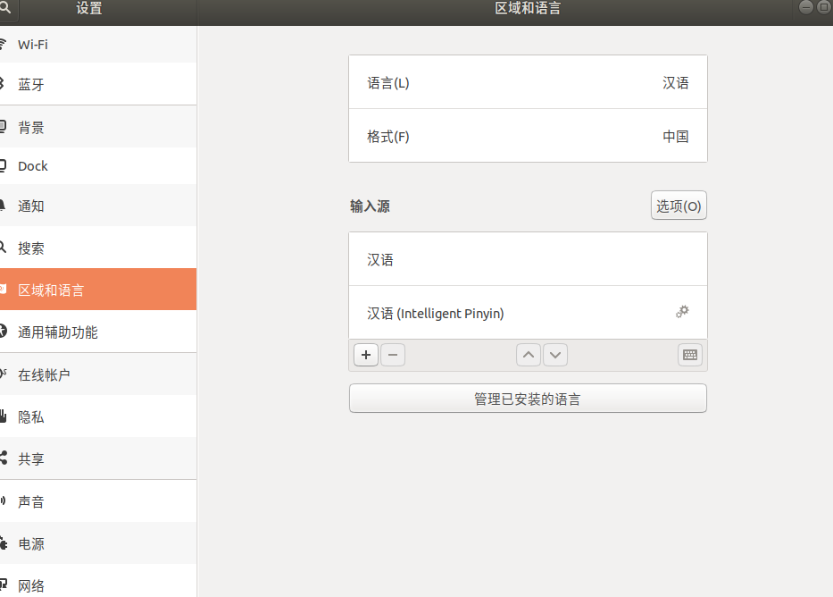
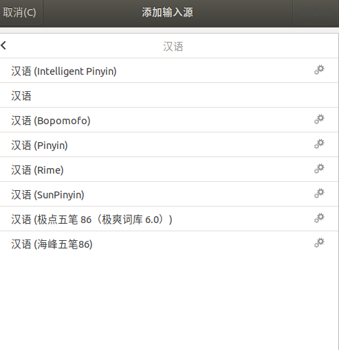
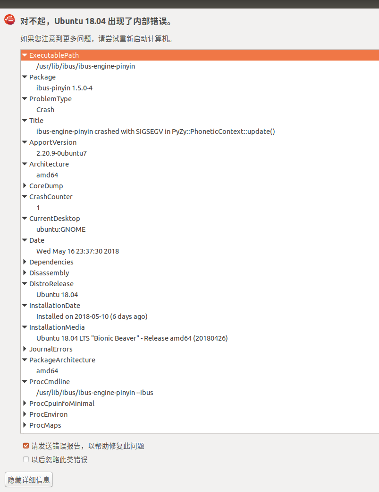
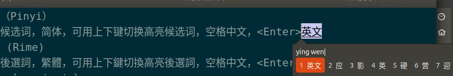
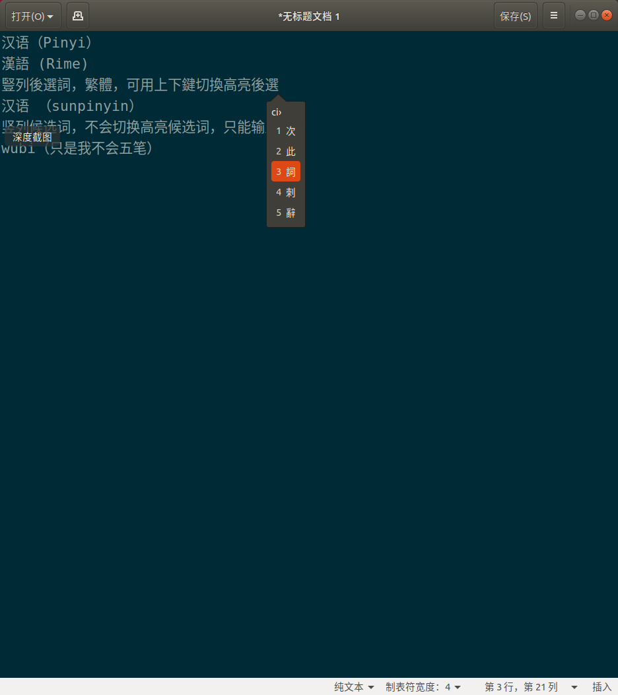
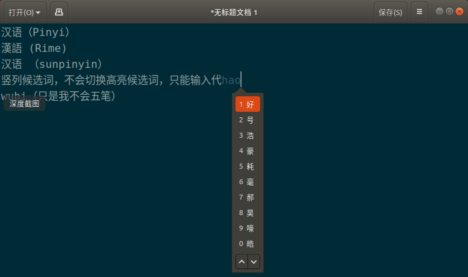

## 解决方法

1. 进入系统设置，选择“区域和语言”，点击“输入源”左下角到加号。

   

   

   

2. 选择“汉语”

   

3. 添加安装的输入法。

   

4. 如果没有你想要到输入法，可以到输入法设置中找到相关选项。我的是ibus,我原本下载了一些输入法到只是后面忘了怎么打开。这里也会提示要要安装到输入法到名字，直接在终端“apt install”就可以下载了。

   

以下是几个输入法到测试效果：（我最后选择了pinyin）

- 汉语(Inteligent pinyin)
   只能输入第一个候选词，选择其他候选词无法输入且出现以下错误报告。

   

- 汉语（bopomofo）
   can't input Chinese

- 汉语（Pinyi）
   横列候选词，简体，可用上下键切换高亮候选词，空格中文，<Enter>英文

   

- 漢語 (Rime)
   豎列後選詞，繁體，可用上下鍵切換高亮後選詞，空格中文，<Enter>英文

   

- 汉语 （sunpinyin）
   竖列候选词，不会切换高亮候选词，只能输入代号，空格中文，<Enter>英文

   

- wubi（只是我不会五笔）
