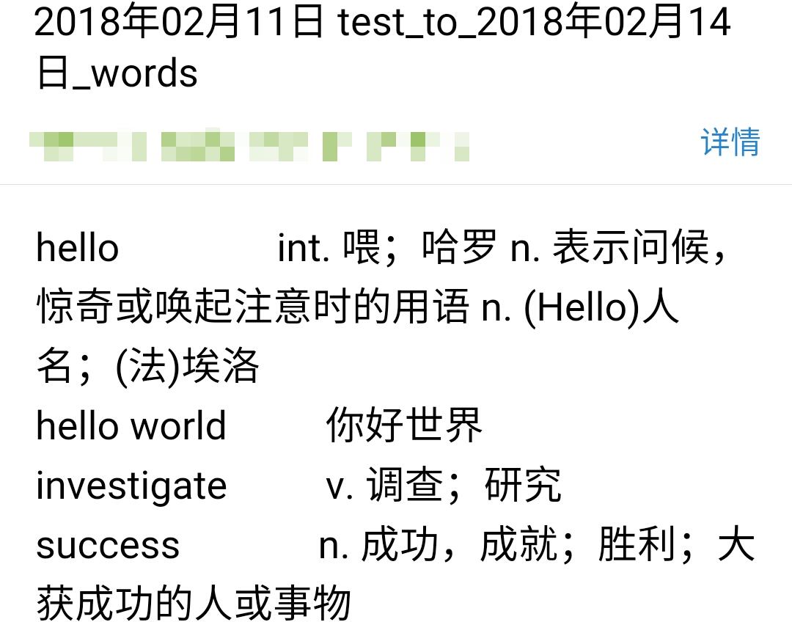

# linux-new-installation-configuration
> Author: Bugatti100Peagle  Mail: 3443988515@qq.com
> Created Time: 2018年02月12日 星期一 13时32分55秒

# linux从零装到魔装

**置顶** [Ubuntu18.04ibus输入法问题和解决办法](./PinyinProblem/输入法解决方法.md)

我经常刷机，有时候有需要配置新的文件，所以写了这个，帮助自己和同样在刷机路上挣扎的朋友在刷机后迅速回到熟悉的操作环境。

[TOC]

## 安装

1. 从U盘引导安装到笔记本，参考[Ubuntu 16.04 U盘安装图文教程](http://www.linuxidc.com/Linux/2016-04/130520.htm) 
   先准备好U盘，文中要求至少8G,我一般选用16G-USB-2.0做引导盘，安装的时候速度快，不会太过卡顿。因为我是直接刷单机的系统，所以直接点击清除磁盘就好了。准备刷双系统的请仔细查看分区。
2. 换主题，[Ubuntu 16.04下安装MacBuntu 16.04 TP 变身Mac OS X主题风格](http://www.linuxidc.com/Linux/2016-06/131947.htm),不过安装了这个主题后，会变得卡顿，所以我后来换用[Ubuntu 16.04主题美化和软件推荐](http://www.linuxidc.com/Linux/2016-09/135165.htm)推荐的Flatabulous主题。

## 配置

### 1. VIM配置 

[超强vim配置文件](https://github.com/ma6174/vim-deprecated),照说明安装，然后对.vimrc文件作一下修改，或者直接复制仓库文件夹下的`vimbk`文件。我因为需要写fortran 程序所以也加入了识别f90的语句。我还加入了状态增强和批量注释的插件的插件。

批量注释

1. control+V进入VISUAL BLOCK模式，按j或k选中多行

2. 按shift+i（大写I），输入注释符（#或//），按一下或者两下Esc，完成注释

批量反注释

1. control+V进入VISUAL  BLOCK模式，按j或k选中多行，按l选中多列
2. 按x或者d删除注释。

[vim插件: airline[状态栏增强] ](http://www.wklken.me/posts/2015/06/07/vim-plugin-airline.html) 

### 2. Sublime text 配置

很少用，装汉化即可

### 3. 输入法

使用自带的输入法就好，虽然搜狗输入法功能丰富，但是在Ubuntu16.04 环境下经常出错异常，不如卸载啦干净。如果你实在喜欢搜狗拼音的话，可以参考[ubuntu安装配置搜狗拼音输入法](https://jingyan.baidu.com/article/a3aad71aa1abe7b1fa009641.html)安装，当你觉得它烦了的时候可以参考[ubuntu彻底卸载搜狗拼音输入法](https://jingyan.baidu.com/article/9faa723154c3dc473d28cb41.html) 

### 4. 字典词典

[无道词典](https://github.com/ChestnutHeng/Wudao-dict) 命令行模式的词典，推荐与espeak联合使用。下载安装后，替换文件夹下的`wdd`文件为仓库中`wudao-dict`文件夹下的`wdd`文件,为了方便自己复习之前查询的单词我还写了一个脚本`wd_words_list.sh`用于发送单词本到制定邮箱, 默认发送最近两次时间戳内的单词，`-a` 选项发送所有单词，有道单词支持导入`.txt`格式的词单文件，背单词从此so easy ! 需要提前配置sendmail。有时候，邮箱会把邮件错认为垃圾邮件，请到邮件垃圾箱或着被拒邮件中找一找。发送到QQ邮箱会比较慢。



有道出了 youdao-dict for linux ，官网上说支持Ubuntu14 + ，不过我的Ubuntu 16.04 LTS 安装是出现问题，是依赖的问题，后来查资料[Ubuntu 16.04安装有道词典的方法](http://blog.csdn.net/zhuiqiuk/article/details/53645023) ，可以安装一个低版本的，不过使用时仅第一次可以打开，之后就一直闪退。所以，还是乖乖用wudao-dict吧。

### 5. 命令行邮件

原本使用的是 mail, 不过配置的时候总是出错，后来换用mutt.安装与配置参考[Ubuntu Mutt邮箱的配置与使用](http://blog.csdn.net/nolan__roronoa/article/details/52335223) 

### 6. QQ

linux上没法用QQ,webQQ界面丑而且收发消息不及时。推荐使用命令行聊QQ[sjdy521/Mojo-Webqq](https://github.com/sjdy521/Mojo-Webqq)，安装依赖要`sudo` ,IRC聊天室可以使用`irssi  -c 127.0.0.1 -P 6667` 或者*雷鸟*的聊天功能，设置端口为6667, 禁用SSL. 

```
雷鸟：保存联系人 直接复制其名称到新建联系人窗口即可	
```

实际上装好后不长使用，我使用linux时一般都在码代码，很少看聊天，必要的工作通讯是通过邮件的。配置好邮件很重要。

但是每次刷机之后不是要重新装一次邮件？保存的联系人都没了。


### 7.[tmux分屏利器](./tmux/tmux.md)


### 8. op 自定义打开网页的命令 [linux_op](./op/linux_op.md)

### 9. ArcTime 字幕压制软件

因为英语学习的需要，所以需要自己压制一些字幕文件用于复读学习，手机上配合点滴复读机使用，背英语简直不能太享受。上[官网下载](http://www.arctime.org/download.html)即可.Ubuntu 16.04 下载前安装 openJDK 和 VLC 

### 10. 火狐浏览器

Chrome浏览器不是预装的，而且国内环境限制，火狐更快一点。浏览器必装插件：

- Yeekit网页翻译
- Zotero 网页插件
- 印象笔记.剪藏
- [常用网页](./common_web_pages.md)

### 11. Sigil Epub阅读器

[Ubuntu下安装ePub编辑器 Sigil](https://www.linuxidc.com/Linux/2012-12/75833.htm) 实际上，它还可以编辑epub文件，如果你Html学得够好的话。

### 12. [git 搭建服务器，同步目录到网页](./git_service.md) 

### 13. [Apache 设置404页](./apache_404.md)

### 14. [Fortran 写的背个X啊，使用方法](./xxx/README.md)

### 15. Typora  

原本typora，有官网，比较容易下载的，奈何国内网络的原因（你知道的），多数时间打不开官网。其实安装命令挺简单的，参考[三. Typora：简单高效的 Markdown 编辑器](http://blog.csdn.net/wirelessqa/article/details/70432631) 安装即可。

### 16. 下载加速器 uGet

一开始换到linux后，下载文件只有靠浏览器自带的下载工具，下载速度真心不敢恭维，还老是断线。突然有点想念 windows 上的迅雷。linux也有一个号称“小迅雷”的下载工具，安装配置参考[Linux小迅雷：uGet下载工具加速](http://www.mintos.org/skill/uget-aria2-tweak.html) 

### 17. WPS

**请删除libreoffice !**

**请删除libreoffice !**

**请删除libreoffice !**

然后参考[ubuntu 16.04安装WPS出现系统缺失字体](http://blog.csdn.net/stefansalvatore/article/details/72765659) 安装wps并修复字体缺失的问题。

### 18. virtualbox

虚拟机，即使使用ubuntu也不代表我们只用ubuntu 了，装一个虚拟机，跑一跑其他的linux发行版，或者怀念一下windows上的QQ。