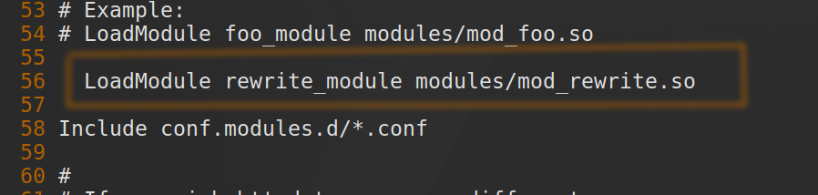
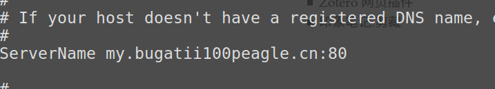
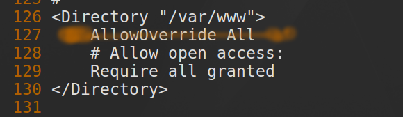
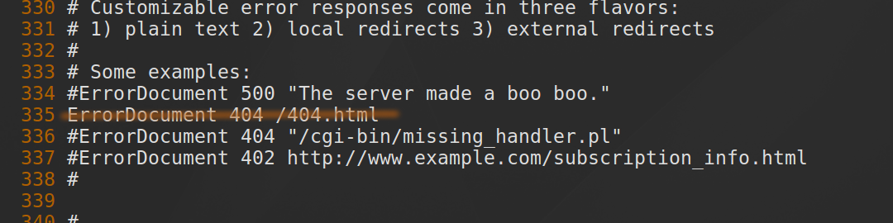
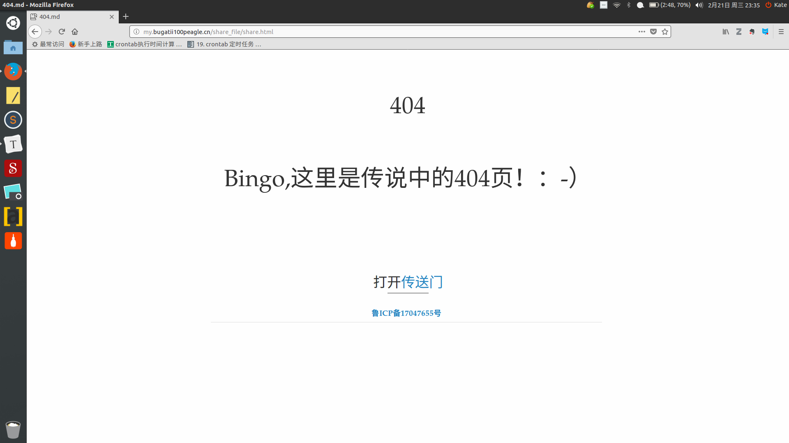

# apache_404

> Author: Bugatti100Peagle  Mail: 3443988515@qq.com
> Created Time: 2018年02月21日 星期三 23时12分38秒

# Apache配置404页

```bash
su root 
cd /etc/httpd/conf   
cp  httpd.conf  httpd.conf.bk   #备份配置文件
vi  httpd.conf
```
修改以下地方



修改主机名



载入模块



开启服务,这里要改网页根目录所在位置，不过我的修改之后并没有成功运行，索性所有`AllowOverride`全改了（不要学我）



指定404页位置

>  注意：404.html是自定义写好的网页文件，放在根目录下，大小必须超过512KB，不可使用绝对路径。

然后，重启httpd服务

```bash
service httpd restart
```

输入一个不存在的网页，检测是否配置成功。


***

参考：

1. [25 个有用 Apache ‘.htaccess’ 技巧 ](https://linux.cn/article-5731-1.html) 
2. [Apache阿帕奇环境设置404页面详细教程](https://jingyan.baidu.com/article/36d6ed1f62f4821bcf4883b2.html) 