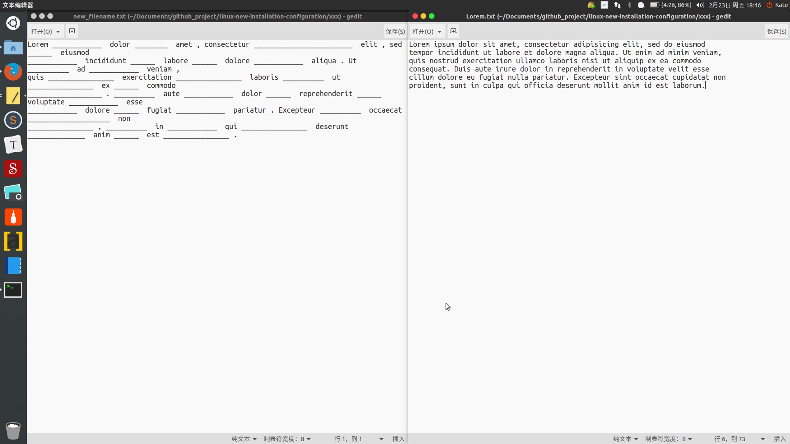
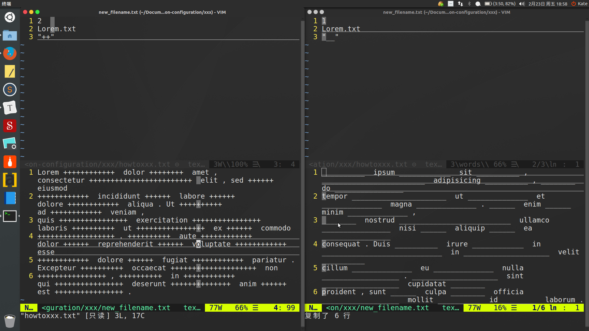

# Fortran 写的背个X啊，使用方法
> Author: Bugatti100Peagle  Mail: 3443988515@qq.com
> Created Time: 2018年02月23日 星期五 18时29分07秒

使用方法:
1. 新建目录，在目录下放置好命令文件，howtoxxx.txt
   第一行 指定 挖奇数，挖偶数,jos
   第二行 指定 被挖文件名 目前只支持一个 filename 
   第三行 指定 每个字母替换格式， 如 "__" 以半角双引号封装 xxx_format
   如：
   ```txt
       2
       englishi_essay.txt
       "__"
   ```

2. 保存退出，确认要进行挖词的文件已放入，并确认文件名正确。

3. 终端输入 `./xxx` 

4. 打开new_filename.txt,检查挖词结果，手动排版或输出PDF打印




效果不错的说。

白诗诗同学用出过一个文章[我所依赖的记忆方法](https://zhuanlan.zhihu.com/p/25603437)，有程序员朋友推出了配套的软件。我也用过了，感觉不错。就是挖词后每个单词只留下很短的一个 _  。一个 '_' 我就很郁闷了，我是打印出来默写英语背诵段落的，太短了写不下。我有尝试过输入""宽的占位符替换，不过太宽了也不好。单词长长短短，实在不好办。奈何我又看不懂我不熟悉的程序语言写的APP。所以，自己做一个吧。用Fortran写的，运行环境Ubuntu16.04，编译器是gfortran.不足之处是，**只能挖英文，且一行字符不能超过500字**。因为程序是依照空格来区分单词的，gfortran不支持可变长度的字符变量的编译，所以我指定了500字符，不够用的同学，手动转行或者修改变量长度吧。

也能挖两种版本，指定一开始的奇偶数就好了。占位符默认是两个(即一个字母替换为两个 _ ，方便打印后书写)，可以自己替换，(双引号里面的才是占位符，fortran读取变量时会自动忽略双引号，只取里面的字符)



